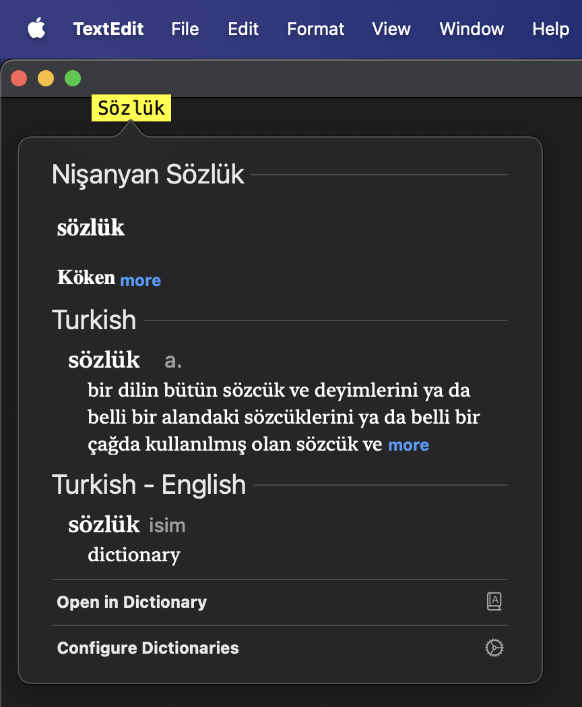

> Bu araç faydalı olduysa asıl emeğin sahibi [Nişanyan Sözlük](https://www.nisanyansozluk.com/)'ü desteklemeyi düşünebilirsiniz. Bağış olanakları için [resmi iletişim sayfasından](https://www.nisanyansozluk.com/iletisim) bilgi alabilirsiniz. Bu proje Nişanyan Sözlük ile bağlantılı değildir ve bağış toplamaz.



# Nişanyan Sözlük → macOS Dictionary

Nişanyan Sözlük'ün etimoloji maddelerini Dictionary.app ve macOS'un **Look Up** (force-click) özelliğine ekler. Kurulduktan sonra tamamen offline çalışır.

## Kurulum

macOS, Python 3.10+, Xcode Command Line Tools (`make` için) ve Apple'ın Dictionary Development Kit'i gerekir. Terminal'de `python3 --version` ve `make --version` ile kontrol edebilirsiniz. Command Line Tools yoksa `xcode-select --install` çalıştırıp kurulumu tamamlayın.

Önce bu repoyu indirin veya klonlayın ve Terminal'de proje klasörünü açın. Aşağıdaki yollar bu klasöre göredir.

1. [Kaggle veri setini](https://www.kaggle.com/datasets/agmmnn/nisanyansozlukcom-database-220821) indirin. ZIP içindeki `output.json` dosyasını `data/raw/extracted/` klasörüne yerleştirin (klasör yoksa oluşturun).
2. [Apple Developer Downloads](https://developer.apple.com/download/all/) sayfasından **Additional Tools for Xcode** indirin (Apple hesabıyla giriş gerekebilir). İçindeki **Dictionary Development Kit** klasörünü reponun köküne kopyalayın. Yol `Dictionary Development Kit/bin/build_dict.sh` olmalıdır; `.dmg` dosyasını kopyalamak yeterli değildir.
3. Repo klasöründe şu komutları çalıştırın:

```sh
python3 -m venv .venv
.venv/bin/pip install -r requirements.txt
.venv/bin/python scripts/build_dictionary_xml.py
make -C dict_src
make -C dict_src install
```

4. Dictionary.app → Settings içinden **Nişanyan Sözlük**'ü etkinleştirin. Bir kelimede Look Up ile deneyin.

Sözlük `~/Library/Dictionaries` içine kurulur. Görünüm değişiklikleri yansımıyorsa Look Up kullandığınız uygulamayı tamamen kapatıp yeniden açın.

## Notlar

Köken, ek açıklama, tarihçe ve ilgili sözcük listeleri aktarılır. Veri 2021 tarihli bir kopyadır; otomatik güncelleme yoktur. Popover içeriği macOS tarafından kısaltılabilir; tamamı “more” veya Dictionary.app üzerinden açılır.

Bu proje Nişanyan Sözlük'ün resmi uygulaması değildir. **Sözlük verisi, üretilmiş XML ve derlenmiş bundle repoya dahil değildir.** İçerik [Nişanyan Sözlük](https://www.nisanyansozluk.com/) kaynaklıdır; veriyi yukarıdaki bağlantıdan ayrıca temin etmeniz gerekir. Bu repo sözlük içeriği için kullanım veya yeniden dağıtım izni vermez; kaynakların koşullarını kontrol etmek kullanıcının sorumluluğundadır.

Kaggle kopyası üçüncü taraf kaynaklıdır; orada erişilebilir olması hak sahibinin izin verdiği anlamına gelmez. Veriyi kullanmadan önce [Nişanyan Sözlük kullanım şartlarını](https://www.nisanyansozluk.com/kullanim-sartlari) inceleyin; gerekli kullanım iznini hak sahibinden alın.
